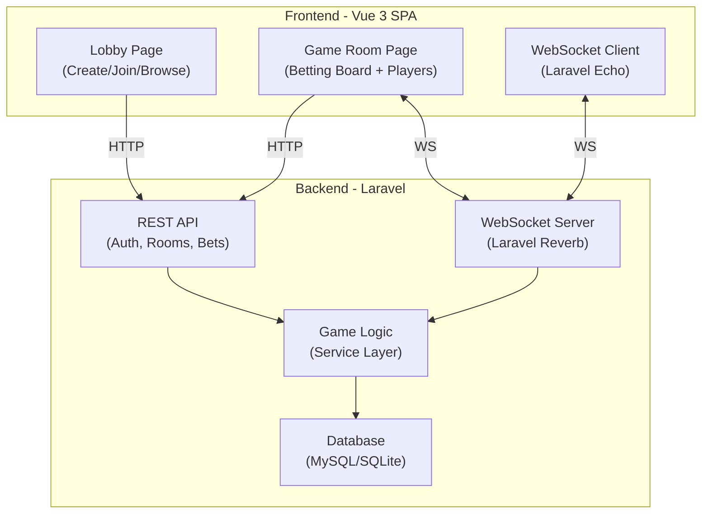
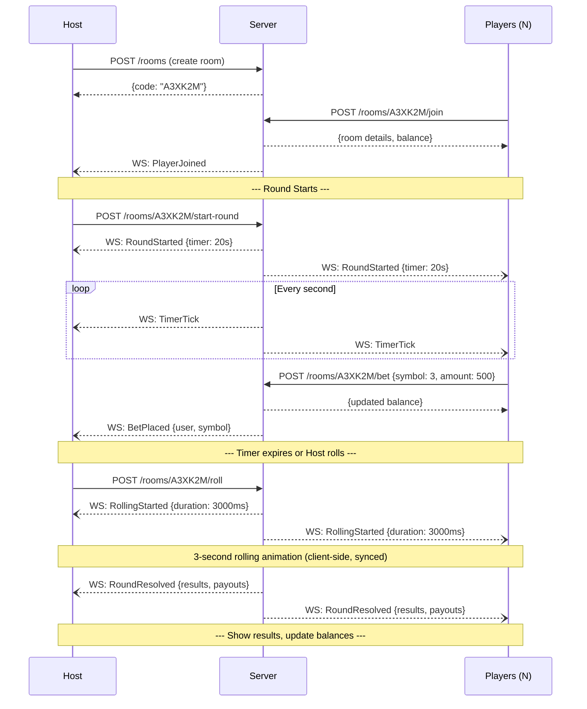

# Kla Klouk (ខ្លាឃ្លោក) — Multiplayer Implementation Plan

## Overview

Transform the current single-player Kla Klouk betting game into a real-time multiplayer experience. A **Host** creates a room, invites players (via invite code or public listing), and controls the game flow. **Players** join, place bets, and see results — all synchronized in real-time via WebSockets.

---

## Current State Analysis

The existing game ([index.html](file:///d:/Web/klalork/index.html)) is a Vue 3 single-player app with:
- 6 animal/symbol betting slots (images `1.jpg`–`6.jpg`)
- Client-side randomization (3 winning symbols chosen randomly)
- Fixed bet amount (500៛ per click), starting balance 10,000៛
- Audio effects (music during roll, click sounds, win sound)
- Modal popups for win/loss results
- All logic runs in the browser — no server, no persistence

---

## Suggestions & UX Improvements

> [!TIP]
> Here are key suggestions to make the multiplayer experience smooth and engaging:

### 🎮 Gameplay Improvements
1. **Configurable bet amounts** — Let players choose 100, 500, 1000, 5000៛ per click (not just fixed 500)
2. **Countdown timer** — After host starts a round, give players 15–30 seconds to place bets. Builds tension and prevents indefinite waiting
3. **Dice roll animation sync** — All players should see the same rolling animation at the same time via WebSocket broadcast
4. **Round history** — Show the last 5–10 results so players can see patterns (even though it's random, players love this)
5. **Spectator mode** — Let users watch a public game without betting

### 🏠 Room Management
6. **Room codes** — Short 6-character alphanumeric codes (e.g., `KLK-A3X`) that are easy to share
7. **Public room browser** — A lobby page listing all public rooms with player count, so anyone can join
8. **Max players per room** — Configurable (default: 8), prevents overcrowding
9. **Host migration** — If the host disconnects, assign the next player as host (or pause the game)
10. **Chat system** — Simple in-game chat with emoji reactions (🎉😭🔥) for social feel

### 💰 Balance & Economy
11. **Server-side balance** — **Critical**: Move balance management to the server. Client-side balance is trivially hackable
12. **Starting balance per room** — Host can set starting balance (5,000 / 10,000 / 50,000៛)
13. **Leaderboard** — Show player rankings within the room by current balance

### 🎨 UX Polish
14. **Player avatars** — Random animal avatars or initials-based profile pictures
15. **Sound control** — Mute/volume buttons (multiplayer = multiple audio sources = chaos)
16. **Mobile responsive** — The betting grid should work well on phones (many Cambodian users are mobile-first)
17. **Connection status indicator** — Show green/yellow/red dot for WebSocket connection health
18. **Reconnection handling** — If a player disconnects mid-round, rejoin them to the same room with their bets intact

---

## Architecture Overview



---

## Open Questions

> [!IMPORTANT]
> 1. **WebSocket provider**: Do you want to use **Laravel Reverb** (free, self-hosted, first-party) or **Pusher** (managed SaaS, has free tier)? I recommend **Reverb** since it's free and built into Laravel 11+.
> 2. **Authentication**: Simple username-only entry (no registration) or full login/register with email/password? For a fun game, username-only with a session token is probably best UX.
> 3. **Persistence**: Should player balances persist across sessions/rooms, or reset each game? (Reset per room is simpler and more fair.)
> 4. **Which suggestions above do you want to include in v1?** I'd recommend: #1 (configurable bets), #2 (countdown timer), #6 (room codes), #7 (public browser), #8 (max players), #11 (server-side balance), #13 (leaderboard), #16 (mobile responsive). The rest can be v2.

---

## Proposed Changes

### Database Schema

#### [NEW] `database/migrations/create_users_table.php`
| Column | Type | Notes |
|---|---|---|
| `id` | bigint PK | Auto-increment |
| `username` | string(50) | Unique per session |
| `avatar_color` | string(7) | Random hex color for avatar |
| `session_token` | string(64) | For re-connection |
| `timestamps` | | |

#### [NEW] `database/migrations/create_game_rooms_table.php`
| Column | Type | Notes |
|---|---|---|
| `id` | bigint PK | |
| `code` | string(6) | Unique, uppercase. e.g. `A3XK2M` |
| `host_id` | FK → users | Room creator |
| `is_public` | boolean | `true` = listed in lobby |
| `status` | enum | `waiting`, `betting`, `rolling`, `showing_results`, `closed` |
| `max_players` | int | Default 8 |
| `starting_balance` | int | Default 10000 |
| `bet_increment` | int | Default 500 |
| `round_number` | int | Current round |
| `round_timer_seconds` | int | Default 20 |
| `timestamps` | | |

#### [NEW] `database/migrations/create_room_players_table.php`
| Column | Type | Notes |
|---|---|---|
| `id` | bigint PK | |
| `room_id` | FK → game_rooms | |
| `user_id` | FK → users | |
| `balance` | int | Player's current balance in this room |
| `is_connected` | boolean | WebSocket connection status |
| `joined_at` | timestamp | |

#### [NEW] `database/migrations/create_rounds_table.php`
| Column | Type | Notes |
|---|---|---|
| `id` | bigint PK | |
| `room_id` | FK → game_rooms | |
| `round_number` | int | |
| `result_1` | int(1-6) | First winning symbol |
| `result_2` | int(1-6) | Second winning symbol |
| `result_3` | int(1-6) | Third winning symbol |
| `started_at` | timestamp | When betting opened |
| `resolved_at` | timestamp | When results were shown |

#### [NEW] `database/migrations/create_bets_table.php`
| Column | Type | Notes |
|---|---|---|
| `id` | bigint PK | |
| `round_id` | FK → rounds | |
| `user_id` | FK → users | |
| `symbol` | int(1-6) | Which symbol was bet on |
| `amount` | int | Total amount bet on this symbol |
| `payout` | int | Calculated after round resolves |

---

### Backend (Laravel API)

#### [NEW] `app/Models/GameRoom.php`
- Eloquent model with relationships to `User` (host), `RoomPlayer` (players), `Round` (rounds)
- Scopes: `scopePublic()`, `scopeJoinable()` (status=waiting, player count < max)
- Helper: `generateUniqueCode()` — 6-char uppercase alphanumeric

#### [NEW] `app/Models/RoomPlayer.php`
- Pivot-like model tracking per-room player state (balance, connection)

#### [NEW] `app/Models/Round.php`
- Stores the 3 winning symbols per round
- `resolveResults()` — calculates payouts using same logic as current `checkWinOrLoss()`

#### [NEW] `app/Models/Bet.php`
- Individual bets placed by players during a round

---

#### [NEW] `app/Services/GameService.php`
Core game logic, extracted into a service class:

```
- createRoom(user, options) → GameRoom
- joinRoom(user, code) → RoomPlayer
- leaveRoom(user, room) → void
- startBettingRound(host, room) → Round
- placeBet(user, round, symbol, amount) → Bet
- resolveRound(host, round) → results[]
- calculatePayout(bets, results) → payouts[]
```

> [!IMPORTANT]
> The payout logic mirrors the current client-side logic:
> - Symbol appears **1 time** in results → **1x** bet returned + **1x** winnings
> - Symbol appears **2 times** → **1x** bet returned + **2x** winnings  
> - Symbol appears **3 times** → **1x** bet returned + **3x** winnings
> - Symbol **not in results** → bet lost

---

#### [NEW] `routes/api.php` — REST Endpoints

| Method | Endpoint | Description | Auth |
|---|---|---|---|
| `POST` | `/auth/enter` | Create/resume session with username | No |
| `GET` | `/rooms` | List public joinable rooms | Yes |
| `POST` | `/rooms` | Create a new room | Yes |
| `GET` | `/rooms/{code}` | Get room details + players | Yes |
| `POST` | `/rooms/{code}/join` | Join a room | Yes |
| `POST` | `/rooms/{code}/leave` | Leave a room | Yes |
| `POST` | `/rooms/{code}/start-round` | Host starts betting phase | Host only |
| `POST` | `/rooms/{code}/bet` | Place a bet `{symbol, amount}` | Player in room |
| `POST` | `/rooms/{code}/roll` | Host triggers roll & resolution | Host only |
| `GET` | `/rooms/{code}/history` | Last N round results | Player in room |

---

#### [NEW] `app/Events/` — WebSocket Events (via Laravel Reverb)

| Event | Channel | Payload | Trigger |
|---|---|---|---|
| `PlayerJoined` | `room.{code}` | `{user, playerCount}` | Someone joins |
| `PlayerLeft` | `room.{code}` | `{user, playerCount}` | Someone leaves |
| `RoundStarted` | `room.{code}` | `{roundNumber, timerSeconds}` | Host starts round |
| `BetPlaced` | `room.{code}` | `{user, symbol}` (no amount for privacy) | Player bets |
| `TimerTick` | `room.{code}` | `{secondsRemaining}` | Every second during betting |
| `RollingStarted` | `room.{code}` | `{rollDurationMs}` | Host clicks roll |
| `RoundResolved` | `room.{code}` | `{results[3], payouts[]}` | Results calculated |
| `GameClosed` | `room.{code}` | `{reason}` | Host closes room |

---

### Frontend (Vue 3 SPA)

> [!NOTE]
> The frontend will be rebuilt as a proper Vue 3 SPA with Vue Router and Pinia for state management. The existing game board UI and styling will be preserved and enhanced.

#### [NEW] `src/router/index.js`
```
/              → LobbyPage (create/join/browse rooms)
/room/:code    → GameRoomPage (the actual game)
```

#### [NEW] `src/stores/gameStore.js` (Pinia)
- Centralized state: `currentUser`, `currentRoom`, `players`, `bets`, `roundState`, `balance`, `results`, `roundHistory`
- Actions that call API + handle WebSocket events

#### [NEW] `src/services/api.js`
- Axios instance with session token in headers
- Methods mapping to each REST endpoint

#### [NEW] `src/services/websocket.js`
- Laravel Echo + Reverb client setup
- Channel subscription/unsubscription
- Event handlers that update Pinia store

---

#### [NEW] `src/pages/LobbyPage.vue`
The entry point. Three sections:
1. **Username entry** — Simple input + "Enter Game" button (creates session)
2. **Create Room** — Form: public/private toggle, max players, starting balance, bet increment
3. **Join Room** — Input field for room code + "Join" button
4. **Public Rooms Browser** — Card list of public rooms with: room code, player count, host name, "Join" button

#### [NEW] `src/pages/GameRoomPage.vue`
The main game view, composed of:
- **Header bar**: Room code (copyable), player count, your balance, leave button
- **Players sidebar/strip**: List of connected players with avatars, names, balances
- **Betting board**: The 6-symbol grid (preserved from current design), with bet amounts shown
- **Results area**: The 3-slot result display (preserved from current design)
- **Host controls** (only visible to host): "Start Round" → "Roll Dice" flow
- **Timer bar**: Countdown bar during betting phase
- **Round history**: Collapsible panel showing last 10 results

#### [NEW] `src/components/BettingBoard.vue`
- Extracted from current inline HTML
- Props: `disabled` (during non-betting phases), `bets`, `results`, `betIncrement`
- Emits: `place-bet(symbol)`

#### [NEW] `src/components/ResultDisplay.vue`
- The 3-result slots with rolling animation
- Receives results via WebSocket, synced across all clients

#### [NEW] `src/components/PlayerList.vue`
- Shows all players in the room
- Highlights current player, shows connection status
- Displays per-player balance (optional: host can toggle visibility)

#### [NEW] `src/components/CountdownTimer.vue`
- Circular or bar countdown timer
- Synced via WebSocket `TimerTick` events

#### [NEW] `src/components/RoomCodeBadge.vue`
- Displays room code in a stylish badge
- Click to copy to clipboard with toast notification

---

## Game Flow (Multiplayer Round)



---

## Tech Stack Summary

| Layer | Technology | Reason |
|---|---|---|
| Backend | **Laravel 11** | Your choice, excellent for APIs + WebSockets |
| WebSockets | **Laravel Reverb** | Free, first-party, self-hosted, easy setup |
| Database | **MySQL** (prod) / **SQLite** (dev) | Laravel default, simple |
| Frontend | **Vue 3** (Composition API) | Already in use, keep consistency |
| State | **Pinia** | Official Vue 3 state management |
| Routing | **Vue Router 4** | SPA page navigation |
| WS Client | **Laravel Echo** + **Reverb client** | Pairs with Reverb server |
| Build | **Vite** | Fast, Laravel 11 default |
| Styling | **Tailwind CSS v3** | Already in use in current code |

---

## Verification Plan

### Automated Tests
```bash
# Laravel Feature Tests
php artisan test --filter=RoomCreationTest
php artisan test --filter=BettingLogicTest
php artisan test --filter=PayoutCalculationTest

# Run all tests
php artisan test
```

### Manual Verification
1. Start Laravel dev server (`php artisan serve`) + Reverb (`php artisan reverb:start`) + Vite (`npm run dev`)
2. Open 3 browser tabs (incognito for separate sessions)
3. **Tab 1**: Create a room → get code → verify it shows in public list
4. **Tab 2 & 3**: Join with the code → verify player list updates in real-time on all tabs
5. **Tab 1 (Host)**: Start round → verify countdown appears on all tabs
6. **Tab 2 & 3**: Place bets → verify balance deducted, bet indicators visible
7. **Tab 1 (Host)**: Roll dice → verify animation plays on all tabs simultaneously
8. Verify payouts match the game rules (1x/2x/3x multiplier)
9. Test disconnection: close Tab 3 → verify player marked as disconnected
10. Test mobile responsiveness on phone viewport
